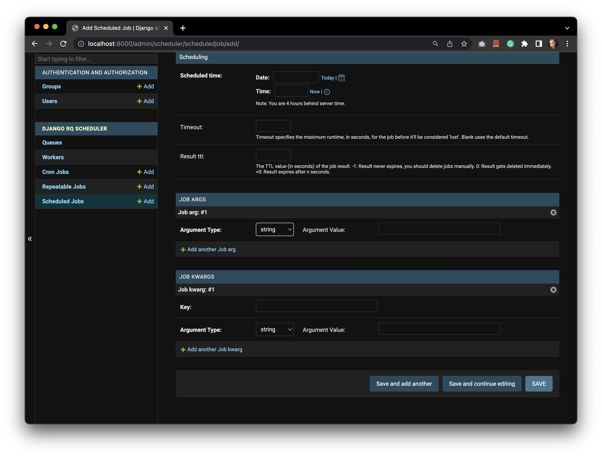

# Usage

## Enqueue jobs from code

```python
from scheduler import job


@job
def long_running_func():
    pass


long_running_func.delay()  # Enqueue function in "default" queue
```

Specifying the queue where the job should be queued:

```python
@job('high')
def long_running_func():
    pass


long_running_func.delay()  # Enqueue function in "high" queue
```

You can pass in any arguments that RQ's job decorator accepts:

```python
from scheduler import job


@job('default', timeout=3600)
def long_running_func():
    pass


long_running_func.delay()  # Enqueue function with a timeout of 3600 seconds.
```

You can set in `settings.py` a default value for `DEFAULT_RESULT_TTL` and `DEFAULT_TIMEOUT`.

```python
# settings.py
RQ = {
    'DEFAULT_RESULT_TTL': 360,
    'DEFAULT_TIMEOUT': 60,
}
```

## Scheduling a job Through django-admin

* Sign in to the Django Admin site (e.g., http://localhost:8000/admin/) and locate the  
  **Django RQ Scheduler** section.
* Click on the **Add** link for the type of job you want to add (`Scheduled Job` - run once, `Repeatable Job` - run
  multiple times, `Cron Job` - Run based on cron schedule).
* Enter a unique name for the job in the **Name** field.
* In the **Callable** field, enter a Python dot notation path to the method that defines the job. For the example  
  above, that would be `myapp.jobs.count`
* Choose your **Queue**.
  The queues listed are defined in your app `settings.py` under `SCHEDULER_QUEUES`.
* Enter the time in UTC the job is to be executed in the **Scheduled time** field.


#### Optional fields:

* Select whether the job should take priority over existing queued jobs when it is queued (jobs waiting to be executed)
  by using **at front**.
* **Timeout** specifies the maximum time in seconds the job is allowed to run. blank value means it can run forever.
* **Result TTL** (Time to live): The time to live value (in seconds) of the job result.
    - `-1`: Result never expires, you should delete jobs manually.
    - `0`: Result gets deleted immediately.
    - `n` (where `n > 0`) : Result expires after n seconds.

Once you are done, click **Save** and your job will be persisted to django database.

### Support for arguments for jobs

django-tasks-scheduler supports scheduling jobs calling methods with arguments, as well as arguments that should be
calculated in runtime.



### Scheduled Job - run once

No additional steps required.

### Repeatable Job - Run a job multiple time based on interval

Additional fields required:

* Enter an **Interval**, and choose the **Interval unit**. This will calculate the time before the function is called  
  again.
* In the **Repeat** field, enter the number of time the job is to be run. Leaving the field empty, means the job will  
  be scheduled to run forever.

### Cron Job - Run a job multiple time based on cron

Additional fields required:

* In the **Repeat** field, enter the number of time the job is to be run. Leaving the field empty, means the job will be
  scheduled to run forever.
* In the **cron string** field, enter a cron string describing how often the job should run.

### Scheduled Job - run once

No additional steps required.

### Repeatable Job - Run a job multiple time based on interval

Additional fields required:

* Enter an **Interval**, and choose the **Interval unit**. This will calculate the time before the function is called  
  again.
* In the **Repeat** field, enter the number of time the job is to be run. Leaving the field empty, means the job will  
  be scheduled to run forever.

### Cron Job - Run a job multiple time based on cron

Additional fields required:

* In the **Repeat** field, enter the number of time the job is to be run. Leaving the field empty, means the job will be
  scheduled to run forever.
* In the **cron string** field, enter a cron string describing how often the job should run.

## Enqueue jobs through command line

It is possible to queue a job to be executed from the command line
using django management command:

```shell
python manage.py run_job -q {queue} -t {timeout} -r {result_ttl} {callable} {args}
```

## Running a worker

Create a worker to execute queued jobs on specific queues using:

```shell
python manage.py rqworker [queues ...]
```

### Running multiple workers as unix/linux services using systemd

You can have multiple workers running as system services.
In order to have multiple rqworkers, edit the `/etc/systemd/system/rqworker@.service`
file, make sure it ends with `@.service`, the following is example:

```ini
# /etc/systemd/system/rqworker@.service
[Unit]
Description = rqworker daemon
After = network.target

[Service]
WorkingDirectory = {{ path_to_your_project_folder } }
ExecStart = /home/ubuntu/.virtualenv/{ { your_virtualenv } }/bin/python \
            {{ path_to_your_project_folder } }/manage.py \
            rqworker high default low
# Optional 
# {{user to run rqworker as}}
User = ubuntu
# {{group to run rqworker as}}
Group = www-data
# Redirect logs to syslog
StandardOutput = syslog
StandardError = syslog
SyslogIdentifier = rqworker
Environment = OBJC_DISABLE_INITIALIZE_FORK_SAFETY = YES
Environment = LC_ALL = en_US.UTF-8
Environment = LANG = en_US.UTF-8

[Install]
WantedBy = multi-user.target
```

After you are done editing the file, reload the settings and start the new workers:
```shell
sudo systemctl daemon-reload
sudo systemctl start rqworker@{1..3} 
```

You can target a specific worker using its number:
```shell
sudo systemctl stop rqworker@2
```